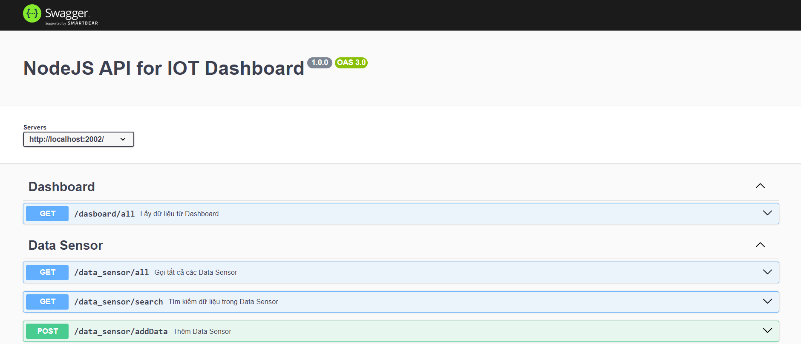

# IoT-Project
Đây là 1 dự án IoT kiểm soát trạng thái trong phòng sử dụng vi điều khiển ESP8266 để giám sát nhiệt độ, độ ẩm, mức độ ánh sáng và kiểm soát việc bật/tắt đèn và quạt. Front-end được xây dựng bằng HTML, CSS và JavaScript, còn Backend sử dụng NodeJS và MySQL.

## Hướng dẫn cài đặt

### Bước 1 : Clone dự án về máy

```
git clone https://github.com/DuyQuandeptrai/GitIOT.git
```

### Bước 2 : Cài đặt thư viện

Cài đặt thư viện bằng cách trỏ đến thư mục:

```
cd backend
```

Sau đó thực hiện lệnh sau, hệ thống sẽ tự động tải xuống các thư viện cần thiết ở package.json.

```
npm install
```

### Bước 3 : Kết nối với Database

Sửa file kết nối đến database nằm trong folder backend:

```
var mysqlConfig = {
    host: 'localhost',
    user: 'root',
    password: 'your_passwword',
    database: 'your_database'
};
```

### Bước 4 : Chạy dự án

Dự án sẽ được chạy bằng lệnh:

```
node main.js
```

Sau đó Server sẽ được khởi chạy. Truy cập vào http://localhost:2002/api-docs/ để xem apidocs của Server.



## Tác giả
- Nguyễn Quang Huy
- Email: nguyenquanghuy872002@gmail.com

## Tài liệu

- Cài đặt Arduino: [Arduino](https://www.arduino.cc/en/software)
- Cài đặt MQTT: [Mosquitto](https://mosquitto.org/download/)
- Cài đặt Nodejs: [Nodejs](https://nodejs.org/en).
- Kiến thức về lắp đặt phần cứng: [Youtube](https://youtu.be/qdxKUQEgDNE?si=jq4B2je0GqNbf6Yp)
- Kiến thức về Swagger: [Swagger](https://swagger.io/docs/)
